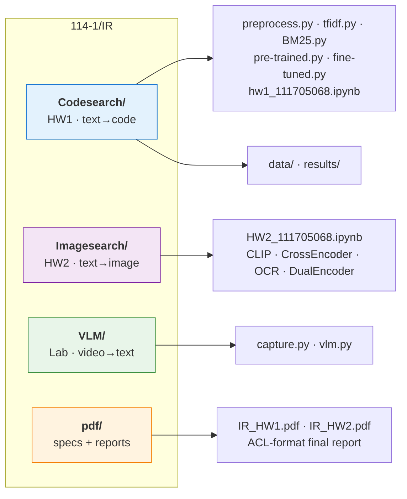
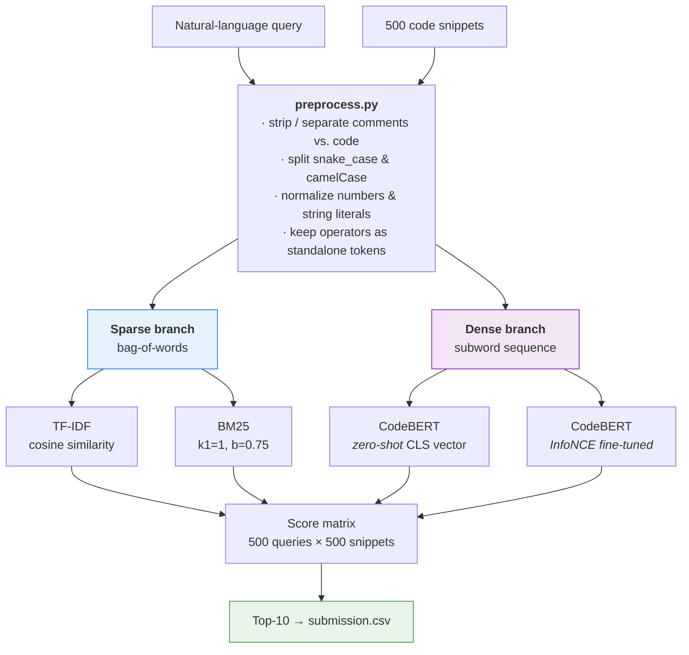
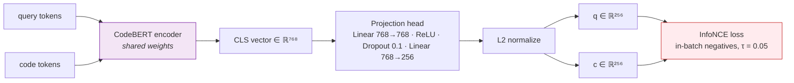
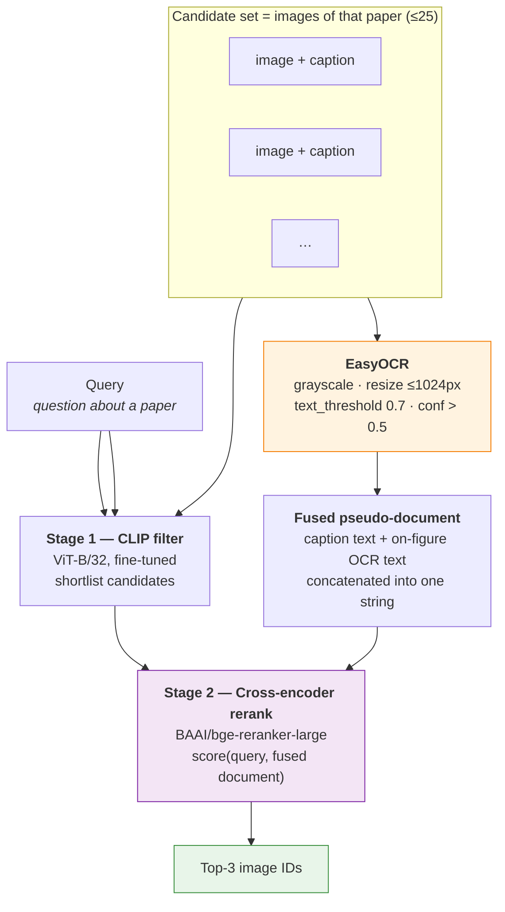
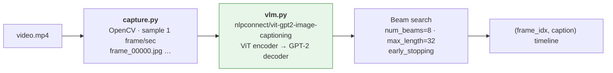
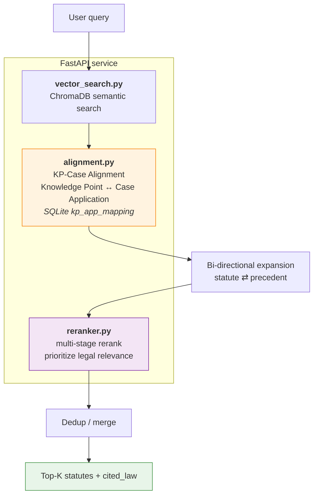
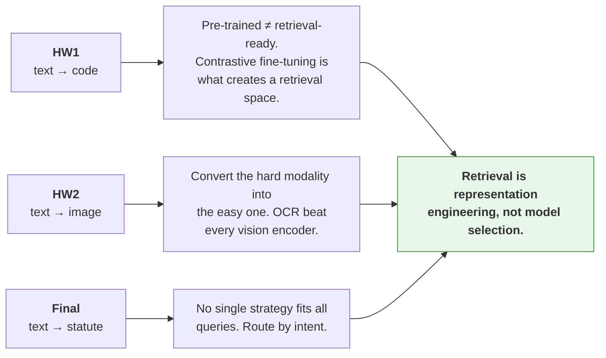

# NYCU 114-1 — Information Retrieval and Extraction

Coursework repository for **Generative Information Retrieval / Information Retrieval and Extraction (Fall 2025, NYCU)**.

The repository collects three retrieval systems built over the semester, each attacking the
same underlying question — *how do you rank a corpus against a natural-language query when
the corpus is not natural language?* — in a different modality:

| # | Assignment | Modality | Task | Headline result |
|---|------------|----------|------|-----------------|
| **HW1** | [`Codesearch/`](Codesearch/) | Text → **Code** | Retrieve the Python function that implements a described behaviour | **Recall@10 = 0.952** (fine-tuned CodeBERT) |
| **HW2** | [`Imagesearch/`](Imagesearch/) | Text → **Image** | Retrieve the figure from a scientific paper that answers a question | **0.94** public leaderboard (cross-encoder + OCR) |
| **Lab** | [`VLM/`](VLM/) | Video → **Text** | Dense-caption a video by frame sampling | qualitative |
| **Final** | [`pdf/`](pdf/) | Text → **Legal statute / precedent** | RAG over traffic law with KP-Case alignment | **Hit@5 = 0.65** on real cases (+85.7% over baseline) |

---

## Table of Contents

1. [Repository Layout](#repository-layout)
2. [Environment Setup](#environment-setup)
3. [HW1 — Text-to-Code Retrieval](#hw1--text-to-code-retrieval)
4. [HW2 — Text-to-Figure Retrieval](#hw2--text-to-figure-retrieval)
5. [Lab — Video Captioning with a Vision-Encoder-Decoder](#lab--video-captioning-with-a-vision-encoder-decoder)
6. [Final Project — Traffic Law & Case Retrieval with RAG](#final-project--traffic-law--case-retrieval-with-rag)
7. [Cross-Assignment Discussion](#cross-assignment-discussion)
8. [Data Policy](#data-policy)
9. [References](#references)

---

## Repository Layout



```
IR/
├── Codesearch/                     # HW1 — sparse vs. dense text-to-code retrieval
│   ├── preprocess.py               #   comment/code splitting + custom lexical tokenizer
│   ├── tfidf.py                    #   from-scratch TF-IDF + cosine ranking
│   ├── BM25.py                     #   from-scratch BM25 (Okapi, k1/b configurable)
│   ├── mean_pooling.py             #   mean-pooling vs. [CLS] pooling ablation
│   ├── pre-trained.py              #   zero-shot CodeBERT bi-encoder
│   ├── fine-tuned.py               #   InfoNCE fine-tuning + inference
│   ├── hw1_111705068.ipynb         #   end-to-end notebook (all four methods)
│   ├── data/                       #   500 snippets / 500 train pairs / 500 test queries  [tracked]
│   ├── results/                    #   four Kaggle submission files                       [tracked]
│   └── best_model.pth              #   476 MB checkpoint                                [ignored]
├── Imagesearch/                    # HW2 — text-to-figure retrieval
│   ├── HW2_111705068.ipynb         #   CLIP / SentenceTransformer / CrossEncoder / OCR / DualEncoder
│   └── data/                       #   Kaggle competition data, ~740 MB                 [ignored]
├── VLM/                            # Lab — video captioning
│   ├── capture.py                  #   1 fps frame extraction with OpenCV
│   ├── vlm.py                      #   ViT-GPT2 captioning over sampled frames
│   ├── img/, *.mp4, vlm_env/       #                                                    [ignored]
├── pdf/                            # course handouts + submitted reports                [ignored]
├── pyproject.toml                  # uv-managed dependency set
└── uv.lock
```

---

## Environment Setup

Python **≥ 3.11**, dependencies managed with [uv](https://docs.astral.sh/uv/).

```bash
uv sync                     # creates .venv and installs the locked dependency set
source .venv/bin/activate
```

Core stack: `torch`, `transformers`, `sentence-transformers`, `scikit-learn`,
`pandas`, `easyocr`, `accelerate`.

Datasets are **not** in the repository (see [Data Policy](#data-policy)). HW2 data is pulled
from Kaggle:

```bash
kaggle competitions download -c 2025-information-retrieval-extraction-homework-2
unzip '*.zip' -d Imagesearch/data
```

---

## HW1 — Text-to-Code Retrieval

> `Codesearch/` · report: `pdf/IR_HW1.pdf`

### Task

Given a natural-language query $q$ (e.g. *"return the maximum value of two numbers"*), rank a
corpus of $|C| = 500$ Python code snippets and return the top-10. The evaluation metric is

$$\mathrm{Recall@}k \;=\; \frac{1}{|Q|}\sum_{i=1}^{|Q|} \mathbb{I}\big(\mathrm{GT}(q_i) \in \mathrm{Top\text{-}}k(q_i)\big)$$

Because each query has **exactly one** relevant snippet, Recall@10 here is equivalent to Hit@10.
A random ranker scores $10/500 = 0.02$ — this is the number every method must beat.

### Dataset

| Split | Rows | Columns |
|-------|------|---------|
| `data/code_snippets.csv` | 500 | `code_id`, `code` |
| `data/train_queries.csv` | 500 | `code`, `query` (aligned positive pairs) |
| `data/test_queries.csv` | 500 | `query_id`, `query` |

### Pipeline



#### 1. Preprocessing — [`preprocess.py`](Codesearch/preprocess.py)

A hand-written tokenizer, deliberately not a subword model, so the sparse branch operates on
*lexically meaningful* units:

```
"def initialize_bagit(self):"
  → ["def", "initialize", "bagit", "(", "self", ")", ":"]
```

The configuration (`PreprocessConfig`) exposes `lowercase`, `split_identifiers`,
`normalize_numbers` and `normalize_strings`. Comments (`//`, `/* */`, `#`, docstrings) are
extracted into a separate channel from executable code, so the two can be weighted or ablated
independently.

#### 2. Sparse retrieval — [`tfidf.py`](Codesearch/tfidf.py), [`BM25.py`](Codesearch/BM25.py)

Both are implemented from scratch (no `sklearn.feature_extraction`).

**TF-IDF** with sublinear term frequency and cosine normalization:

$$\mathrm{TF}(t,d) = 1 + \log f_{t,d}, \qquad \mathrm{IDF}(t) = \log\frac{N}{n_t}, \qquad w_{t,d} = \mathrm{TF}(t,d)\cdot\mathrm{IDF}(t)$$

$$\mathrm{Sim}(q,d) = \frac{\mathbf{v}_q\cdot\mathbf{v}_d}{\lVert\mathbf{v}_q\rVert\,\lVert\mathbf{v}_d\rVert}$$

**BM25 (Okapi)** with term-frequency saturation and document-length normalization:

$$\mathrm{BM25}(q,d) = \sum_{t\in q}\mathrm{IDF}(t)\cdot\frac{f_{t,d}\,(k_1+1)}{f_{t,d} + k_1\!\left(1-b+b\,\frac{|d|}{\mathrm{avgdl}}\right)}, \qquad \mathrm{IDF}(t) = \log\frac{N-n_t+0.5}{n_t+0.5}$$

IDF values and the per-document normalization factor $k_1(1-b+b\,|d|/\mathrm{avgdl})$ are
precomputed once at index time ([`BM25.py:47-59`](Codesearch/BM25.py#L47-L59)), reducing query
scoring to a sum over query terms that actually occur in the document.

#### 3. Dense retrieval — [`pre-trained.py`](Codesearch/pre-trained.py), [`fine-tuned.py`](Codesearch/fine-tuned.py)

Backbone: **`microsoft/codebert-base`** (RoBERTa-architecture, 50 265-token BPE vocabulary,
pre-trained with MLM + Replaced Token Detection on paired NL/PL corpora).

A **shared-weight bi-encoder** with a projection head maps both modalities into one
$\mathbb{R}^{256}$ space:



Training objective — **InfoNCE with in-batch negatives**: within a batch of $N$ pairs, the
$i$-th query treats its own snippet as the positive and the other $N-1$ snippets as negatives.

$$\mathcal{L} = -\frac{1}{N}\sum_{i=1}^{N}\log\frac{\exp\!\big(\mathrm{sim}(\mathbf{q}_i,\mathbf{c}_i)/\tau\big)}{\sum_{j=1}^{N}\exp\!\big(\mathrm{sim}(\mathbf{q}_i,\mathbf{c}_j)/\tau\big)}, \qquad \mathrm{sim}(\mathbf{q},\mathbf{c}) = \frac{\mathbf{q}\cdot\mathbf{c}}{\lVert\mathbf{q}\rVert\lVert\mathbf{c}\rVert}$$

| Hyper-parameter | Value |
|---|---|
| Backbone | `microsoft/codebert-base` (768-d) |
| Projection dim | 256 |
| Max sequence length | 256 tokens |
| Batch size | 8 (⇒ 7 in-batch negatives) |
| Epochs | 20 |
| Optimizer | AdamW, lr $2\times10^{-5}$ |
| Schedule | linear warmup over 10% of steps, then linear decay |
| Temperature $\tau$ | 0.05 |
| Seed | 42 |

At inference, all snippets are encoded once into $M \in \mathbb{R}^{n\times 256}$ and every query
is scored by a single matrix product $\mathrm{Sim}(\mathbf{q}, M) = \mathbf{q}M^{\top}$.

### Results

| Method | Type | Recall@10 | Cost |
|--------|------|-----------|------|
| TF-IDF | sparse | **0.864** | very low |
| BM25 ($k_1=1$, $b=0.75$) | sparse | 0.852 | low |
| CodeBERT, zero-shot `[CLS]` | dense | 0.024 | high |
| CodeBERT, InfoNCE fine-tuned | dense | **0.952** | high |

**Tokenizer ablation** (zero-shot CodeBERT, measured on the 500 train pairs):

| Tokenization fed to CodeBERT | Recall@10 |
|---|---|
| Native CodeBERT BPE | 0.144 |
| Custom lexical tokenizer → `convert_tokens_to_ids` | 0.034 |

### Analysis

- **Sparse beats zero-shot dense by 36×.** At Recall@10 = 0.024 the pre-trained encoder is
  statistically indistinguishable from the random baseline of 0.02. MLM and RTD produce
  representations optimized for *token reconstruction*, not for *sequence-level alignment*; the
  raw `[CLS]` vector simply is not a retrieval embedding. This is the single most instructive
  result in the assignment.
- **TF-IDF edges out BM25 (0.864 vs. 0.852)**, inverting the usual ordering. BM25's advantages —
  TF saturation and length normalization — assume long documents with repeated terms. These
  snippets are short and no single identifier dominates, so saturation buys nothing while cosine
  normalization on the TF-IDF side does the length correction more directly.
- **Feeding a custom tokenizer into a subword model is actively harmful** (0.144 → 0.034).
  Lexical tokens like `initialize` are mapped through `convert_tokens_to_ids` against a BPE
  vocabulary they were never registered in, so most map to `<unk>`. The tokenizer must match the
  model that consumed it during pre-training — a good tokenizer for the sparse branch is a bad
  one for the dense branch.
- **Fine-tuning recovers everything and more (0.024 → 0.952).** Twenty epochs of InfoNCE on 500
  pairs is enough to reshape the embedding geometry, because contrastive learning optimizes the
  exact quantity being evaluated: relative rank under cosine similarity.

### Reproduction

```bash
cd Codesearch
python preprocess.py                      # → data/*_proc.csv
python tfidf.py                           # → results/tf_idf_submission.csv
python BM25.py                            # → results/bm25_submission.csv
python pre-trained.py                     # → results/pre_trained_submission.csv
python fine-tuned.py                      # trains, then → results/fine_tuned_submission.csv
```

Or run [`hw1_111705068.ipynb`](Codesearch/hw1_111705068.ipynb) top-to-bottom for all four.

---

## HW2 — Text-to-Figure Retrieval

> `Imagesearch/` · report: `pdf/IR_HW2.pdf`

### Task

Given a question about a scientific paper, retrieve the **figure from that paper** which answers
it. Crucially, the candidate set is scoped per paper (≤ 25 images), turning a corpus-wide
retrieval problem into a **hard re-ranking problem within a narrow, topically homogeneous
candidate set** — every candidate comes from the same paper, so lexical topic overlap carries
almost no signal.

Submission returns the **top-3** image IDs per query.

### Dataset

| File | Rows | Papers | Contents |
|------|------|--------|----------|
| `train.jsonl` | 8 230 | 1 646 | `id`, `paper_id`, `query`, `image_id`, `image_path`, `image_caption` |
| `test.jsonl` | 403 | 50 | `id`, `paper_id`, `query` |
| `test_images.jsonl` | 753 | 50 | `paper_id`, `image_id`, `image_caption`, `image_path` |

≈ 15 candidate images per test paper.

### Method Progression

Five architectures were evaluated. The narrative of this assignment is that the **visual**
approaches lost to the **textual** ones — and that the deciding signal turned out to be text
*inside* the images.



**① Zero-shot CLIP** — `openai/clip-vit-base-patch32`, cosine similarity between the query text
embedding and each image embedding. Strong on train, weak in generalization.

**② Fine-tuned CLIP** — contrastive fine-tuning with a *document-scoped* negative mask, which is
the interesting bit. Standard CLIP training uses all in-batch negatives; here the loss is masked
so that only images **from the same paper** count as negatives:

```python
same_paper    = paper_ids[:, None] == paper_ids[None, :]
positive_mask = torch.eye(B, dtype=torch.bool)
negative_mask = same_paper & ~positive_mask      # same paper, different image
valid_mask    = positive_mask | negative_mask    # everything else is ignored
masked_logits = logits.masked_fill(~valid_mask, -1e9)
loss = 0.5 * (F.cross_entropy(masked_logits, labels)      # text → image
            + F.cross_entropy(masked_logits.T, labels))   # image → text
```

This matches the training objective to the evaluation condition — the model is only ever asked to
discriminate *within* a paper, which is exactly what the test set requires. Hyper-parameters:
AdamW, lr $5\times10^{-6}$, batch 15, $\tau = 0.07$, 10 epochs, symmetric bidirectional loss.

**③ SentenceTransformer over captions** — `intfloat/e5-large-v2`, bi-encoder cosine similarity
between query and caption. Discards pixels entirely, and *beats* fine-tuned CLIP.

**④ Cross-encoder over captions** — `BAAI/bge-reranker-large` jointly encodes
`[query, caption]` and produces a relevance logit. Affordable precisely because the candidate set
is ≤ 25, so full $O(|Q|\times|C_{\text{paper}}|)$ joint encoding is tractable.

**⑤ Cross-encoder over caption + OCR** *(best)* — EasyOCR extracts on-figure text (axis labels,
legends, method names, table headers), which is concatenated with the caption into a single
pseudo-document before re-ranking.

**⑥ Dual-encoder** *(explored, not submitted)* — frozen `microsoft/convnext-tiny-224` +
`all-MiniLM-L6-v2` with two trainable projection heads into $\mathbb{R}^{256}$; only the
projections were optimized (AdamW, lr $10^{-3}$). More architectural freedom, more tuning burden,
no gain over the cross-encoder.

### Results

| # | Method | Signal used | Public score |
|---|--------|-------------|--------------|
| ① | Zero-shot CLIP ViT-B/32 | pixels | strong on train, drops on test |
| ② | Fine-tuned CLIP (document-scoped mask) | pixels | ≈ 0.62 (plateau) |
| ③ | SentenceTransformer `e5-large-v2` | captions | > ② |
| ④ | Cross-encoder `bge-reranker-large` | captions | **0.83** |
| ⑤ | Cross-encoder + **OCR** | captions + on-figure text | **0.94** |

Public leaderboard progression:

| Configuration | Score | |
|---|---|---|
| Fine-tuned CLIP | 0.62 | `████████████▍            ` |
| Cross-encoder (captions) | 0.83 | `████████████████▌        ` |
| Cross-encoder + OCR | **0.94** | `██████████████████▊      ` |

### Analysis

- **Pixels lost to text.** Scientific figures — plots, architecture diagrams, result tables — are
  far outside CLIP's natural-image pre-training distribution. The caption is a human-written,
  domain-accurate description; the image encoder never learned to read a $y$-axis.
- **OCR was the single largest win (+0.11).** Queries frequently mention domain-specific terms
  (dataset names, metric names, ablation labels) that appear *rendered inside the figure* but
  never in the caption. OCR converts an unreadable modality into the modality the reranker is
  already good at.
- **Cross-encoder > bi-encoder because the candidate set is small.** Joint query–document
  attention resolves fine distinctions that independently-computed embeddings blur, and with
  ≤ 25 candidates the quadratic cost never bites.
- **The generalization gap drove the final design.** CLIP consistently outperformed on train but
  collapsed on public test, suggesting the public split is biased toward caption-retrievable
  samples. To hedge against the private split having the opposite bias, the final system is a
  **two-stage hybrid**: CLIP filters the candidate pool, the cross-encoder makes the final pick.
  This is an explicit robustness trade — giving up some public score for variance reduction.
- **A note on `hash(pid)` in the CLIP mask.** Python string hashing is salted per process
  (`PYTHONHASHSEED`), so the `paper_id → int` mapping is not stable across runs. It is
  collision-safe *within* a run, which is all the mask requires, but it makes runs
  non-reproducible; a deterministic `paper_id → index` dict would be the fix.

### Reproduction

Open [`Imagesearch/HW2_111705068.ipynb`](Imagesearch/HW2_111705068.ipynb). Sections are ordered:
`Test SentenceTransformer` → `Test CLIP` → `Test CrossEncoder` → `Fine-tune CLIP` →
`Cross-encoder + OCR Submission` → `Test Dual-Encoder`. A GPU is assumed (Colab).

---

## Lab — Video Captioning with a Vision-Encoder-Decoder

> `VLM/`

A small exercise in turning a video into a retrievable text stream — the bridge between HW2's
image understanding and a general multimodal index.



- [`capture.py`](VLM/capture.py) — decodes the video, computes `frame_interval = fps × interval`
  and writes one JPEG per sampled second.
- [`vlm.py`](VLM/vlm.py) — the `VideoCaptioning` class wraps `VisionEncoderDecoderModel` +
  `ViTImageProcessor` + `AutoTokenizer`; `caption_video()` streams frames straight from the
  `VideoCapture` object (no intermediate files) and returns a `(frame_count, caption)` timeline.

The resulting timeline is the natural index unit for video retrieval: caption each sampled
second, embed the captions, and video search reduces to the text retrieval problem of HW1.

---

## Final Project — Traffic Law & Case Retrieval with RAG

> Report: `pdf/Association_for_Computational_Linguistics__ACL__conference.pdf` (ACL format).
> The system itself is a standalone FastAPI service and is not vendored into this repository.

### Problem

Conventional RAG over legal text retrieves *facts without application guidance*: it can find the
statute but cannot reason about whether it applies. It also suffers **context fragmentation** —
the correlation between a statute and the precedents that interpret it is lost when both are
chunked independently.

### Data

| Source | Content |
|--------|---------|
| National Laws Database | 93 regulations from the *Road Traffic Management and Penalty Act* (**Knowledge**) |
| Judicial Yuan Open Data Platform | traffic-related judgments, August 2025 → vector DB (**Application**) |

Two evaluation query sets, deliberately temporally separated:

1. **Synthetic law-based queries** — generated by regex-extracting each numbered item and
   templating a penalty question. Ground truth = the source statute text.
2. **Case-based queries** — raw chunks from **September 2025** judgments (i.e. *after* the
   training window). Ground truth = the statute cited in the judgment.

### Architecture



**Baseline:** embed the query → cosine search over the statute collection → top-$K$ → extract the
`cited_law` field as the predicted answer.

**Main approach:** *KP-Case Alignment* maps abstract legal **Knowledge Points** to concrete
**Case Applications** through an SQLite mapping table, enabling bi-directional expansion — a
statute query pulls in the precedents that apply it, and a case query pulls in the statutes it
cites — followed by multi-stage reranking, deduplication and merging.

**Metrics:** Precision@K, MRR, Hit@K. Targets: Hit@5 (cases) ≥ 0.60, latency ≤ 3 s.

### Results

**Scenario 1 — synthetic law-based queries**

| Metric | @1 | @3 | @5 | @10 |
|--------|----|----|----|-----|
| Baseline — Precision | **0.41** | 0.21 | 0.14 | 0.08 |
| Baseline — MRR | **0.41** | **0.51** | **0.53** | **0.54** |
| Baseline — Hit | **0.41** | **0.63** | **0.72** | **0.82** |
| Ours — Precision | 0.32 | 0.21 | 0.13 | 0.03 |
| Ours — MRR | 0.32 | 0.44 | 0.47 | **0.54** |
| Ours — Hit | 0.32 | 0.53 | 0.67 | 0.75 |

**Scenario 2 — real case-based queries (September data)**

| Metric | @1 | @3 | @5 | @10 |
|--------|----|----|----|-----|
| Baseline — Precision | 0.13 | 0.08 | 0.06 | 0.05 |
| Baseline — MRR | 0.13 | 0.24 | 0.28 | 0.31 |
| Baseline — Hit | 0.13 | 0.26 | 0.35 | 0.43 |
| Ours — Precision | **0.23** | **0.16** | **0.14** | **0.08** |
| Ours — MRR | **0.23** | **0.46** | **0.52** | **0.54** |
| Ours — Hit | **0.23** | **0.56** | **0.65** | **0.77** |

**Impact of expansion, by query type**

| Dataset | Baseline Hit@5 | Ours Hit@5 | Δ |
|---------|----------------|------------|---|
| Synthetic (laws) | 0.72 | 0.67 | **−6.9%** |
| Real (cases) | 0.35 | 0.65 | **+85.7%** |

### Error Analysis

- **Query verbosity sensitivity.** The expansion mechanism has a *dual nature*: +85.7% relative
  Hit@5 on narrative case queries, −6.9% on short factual law queries. For concise queries,
  expansion pulls in adjacent-but-distinct cases whose noise dilutes the correct statute's vector
  score. **Take-away: there is no one-size-fits-all retrieval strategy** — the system needs a
  query-intent router so that simple factual lookups bypass the expansion layer while narrative
  descriptions use it.
- **The "single truth" penalty.** Precision@K collapses sharply with $K$ (0.32 @1 → 0.03 @10 for
  law queries). This is structural, not a bug: a traffic violation typically maps to *exactly
  one* statute, so $K-1$ of the $K$ retrieved items are guaranteed false positives. High MRR with
  low Precision@10 is the correct signature for a decisive system on a single-ground-truth task.
- **Vector database noise.** Chunks stored in ChromaDB retain unprocessed case details — dates,
  names, procedural boilerplate — irrelevant to the legal principle. This noise aligns
  serendipitously with parts of the expansion queries, producing "hallucinated" retrieval: a case
  that *sounds* similar but cites a different law.

### Future Work

Data cleaning to reduce chunk noise · a query-routing classifier that toggles expansion on
query length and complexity · improved `alignment_builder.py` logic to raise case-query Hit rates.

---

## Cross-Assignment Discussion

Read together, the three assignments trace one argument.



| Theme | HW1 | HW2 | Final |
|-------|-----|-----|-------|
| **Sparse vs. dense** | TF-IDF 0.864 beat zero-shot dense 0.024 | text-side matching beat pixel-side embedding | vector search alone was the baseline to beat |
| **What actually helped** | InfoNCE fine-tuning (0.024 → 0.952) | OCR fusion (0.83 → 0.94) | KP-Case alignment on real queries (+85.7%) |
| **Cost of the win** | 20 epochs on GPU | OCR pass over every image | expansion regresses short factual queries |
| **Re-ranking** | proposed as two-stage retrieve-then-rerank | *the* deciding component | multi-stage reranker in production path |

Three recurring lessons:

1. **A pre-trained encoder is not a retriever.** MLM/RTD objectives optimize token
   reconstruction; retrieval needs sequence-level metric geometry. Both HW1 (0.024 → 0.952) and
   HW2 (CLIP plateau at 0.62) show the gap, and in both cases a contrastive objective aligned to
   the *evaluation condition* closes it.
2. **Choose the modality you can model well.** HW2's winning move was not a better vision model
   but a text extraction step. When a modality is out-of-distribution for every available
   encoder, transcode it rather than fight it.
3. **Match the architecture to the candidate-set size.** Bi-encoders scale to corpus-wide
   retrieval; cross-encoders win when the candidate set is small. HW1 proposes retrieve-then-rerank
   for a 500-document corpus; HW2's ≤ 25-image candidate set makes full cross-encoding affordable
   outright.

---

## Data Policy

This repository tracks **code, configuration and small CSV metadata only**. The excluded
artifacts total roughly **2.1 GB**:

| Artifact | Size | Why excluded | How to restore |
|----------|------|--------------|----------------|
| `Codesearch/best_model.pth` | 476 MB | regenerable checkpoint | `python Codesearch/fine-tuned.py` |
| `Imagesearch/data/` | 738 MB | Kaggle competition data | `kaggle competitions download -c 2025-information-retrieval-extraction-homework-2` |
| `VLM/vlm_env/`, `VLM/img/`, `*.mp4` | 877 MB | virtualenv, extracted frames, source video | `uv sync`; `python VLM/capture.py` |
| `.venv/` | 1.0 GB | virtualenv | `uv sync` |
| `pdf/` | 1.8 MB | course handouts, submitted reports | — |

**Deliberately kept in-tree:** `Codesearch/data/*.csv` (≈ 2.5 MB) and `Codesearch/results/*.csv`,
so the sparse-retrieval pipeline and every submission stay reproducible without Kaggle access.

All figures in this README are **Mermaid diagrams rendered by GitHub**, not committed image
files — consistent with the same policy.

---

## References

1. Feng et al. *CodeBERT: A Pre-Trained Model for Programming and Natural Languages.* EMNLP Findings, 2020.
2. Radford et al. *Learning Transferable Visual Models From Natural Language Supervision (CLIP).* ICML, 2021.
3. Robertson & Zaragoza. *The Probabilistic Relevance Framework: BM25 and Beyond.* FnTIR, 2009.
4. van den Oord et al. *Representation Learning with Contrastive Predictive Coding (InfoNCE).* arXiv:1807.03748, 2018.
5. Wang et al. *Text Embeddings by Weakly-Supervised Contrastive Pre-training (E5).* arXiv:2212.03533, 2022.
6. Xiao et al. *C-Pack: Packed Resources For General Chinese Embeddings (BGE reranker).* arXiv:2309.07597, 2023.
7. Liu et al. *ConvNeXt: A ConvNet for the 2020s.* CVPR, 2022.
8. Guo et al. *LightRAG: Simple and Fast Retrieval-Augmented Generation.* arXiv:2410.05779, 2024.

---

*Author: WANG TZU-YI (111705068) · National Yang Ming Chiao Tung University · Fall 2025*
